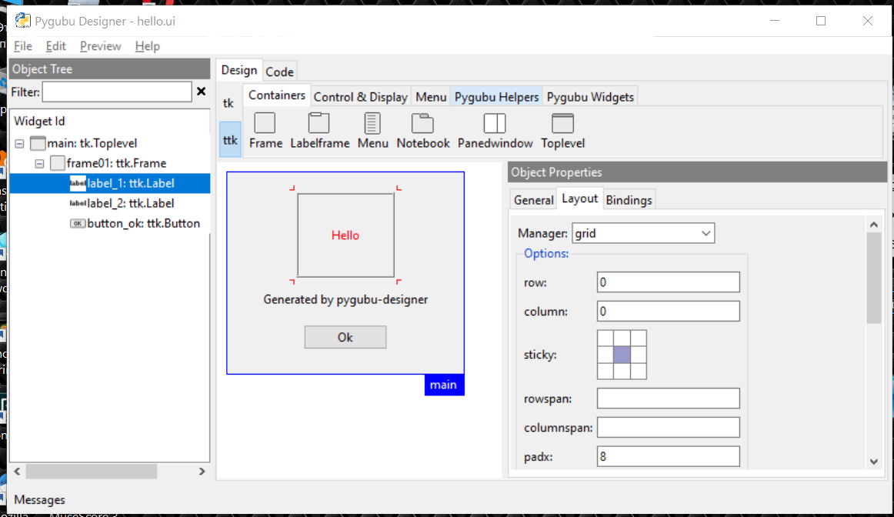
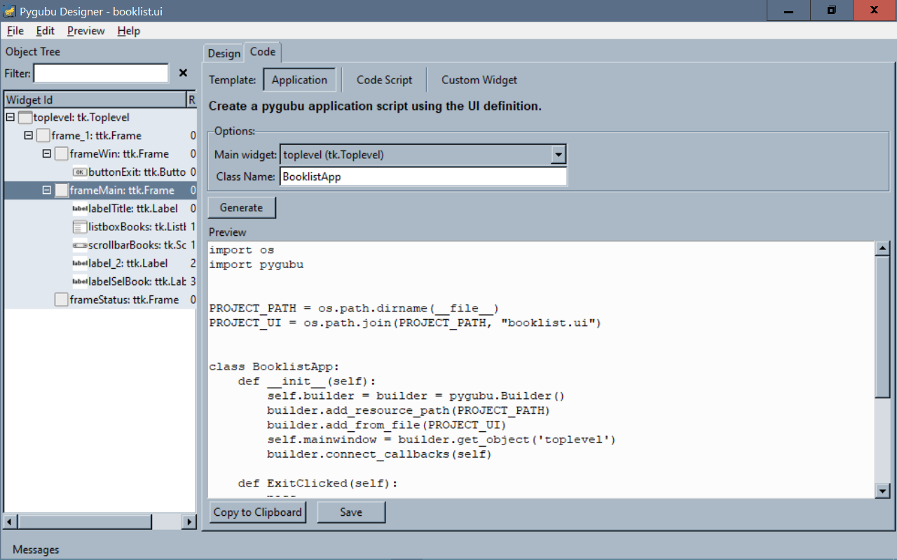
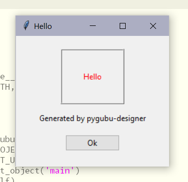
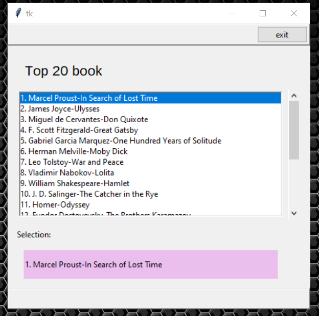

#  Наконец, и tkinter получил своё...

  А именно  олдскульный formbuider - Pygubu.

Tkinter  одна из очень старых библиотек Питона. Ещё сам  Гвидо ван Россум приложил свои руки к её написанию. Но несмотря на свой  возраст, она по-прежнему используется. И хотя  комплект виджетов довольно ограничен, и он по-прежнему присутствует во всех версиях и в качестве инструмента для  создания несложного графического интерфейса вполне подходит.  

И хотя для питона существуют и другие  GUI библиотеки -  [wxPython](https://en.wikipedia.org/wiki/WxPython), [PyQt](https://en.wikipedia.org/wiki/PyQt), [PySide](https://en.wikipedia.org/wiki/PySide), [Pygame](https://en.wikipedia.org/wiki/Pygame), [Pyglet](https://en.wikipedia.org/wiki/Pyglet) и [PyGTK](https://en.wikipedia.org/wiki/PyGTK), tkinter  продолжает довольно активно использоваться вместе с  самыми новейшими средствами  (pandas, matplotlib и пр.).   О растущей популярности Tkinter  нам говорит и появление в последние годы нескольких книг на эту тему.  Для знакомства с предметом я бы порекомендовал вот такую книгу: Mark Roseman. Modern Tkinter for Busy Python Developers( последнее издание - Late Afternoon Press; 3rd ed. edición.8 Octubre 2020). При сравнительно небольшом объёме текста, технология использования библиотеки изложена довольно наглядно.   


Большим недостатком библиотеки, на мой взгляд, является отсутствие визуальных средств создания форм.  Припоминается несколько попыток создать подобные средства. Не могу сказать, что они все они были плохи, но до нынешних дней они не дожили . Но вот, кажется, что-то похожее на желаемое уже появилось.  

Программа явно создана создана под влиянием glade, который хорошо знают пользователи Gnome/gtk. Так что теперь можно создавать экранные формы визуально,  с помощью программы-дизайнера, сохранять созданные формы во внешний файл, который можно   впоследствии использовать для автоматического создания форм и дописывать обработчики событий. 

 В целом задачу быстрого создания форм программа вполне решает. Ну а поскольку ссылки на виджеты можно получить внутри вашей программы, то вы вполне можете реализовать все желаемые  функции, и это не потребует сложных усилий.  Собственно нарисовать интерфейс в визуальной манере, сохранить его виде xml ресурса, затем загрузить и получить работающий прототип графического интерфейса за несколько минут это как раз тот самый способ, который сильно упрощает жизнь и экономит время.

## Установка 

Стандартная установка из  PyPI.   

python -m pip install pygubu	
python -m pip install pygubu-designer

Другие способы установки тоже работают. Пользователи  Linux в большинстве случаев могут могут установить пакеты из репозитория своего дистрибутива,  и, разумеется, из клонировать исходники из  гитхаба  также не возбраняется. 

## Традиционный HELLO WORLD.

Попробуем создать простейшее приложение.
Создадим следующие элементы интерфейса:

* tk.Toplevel 
  * ttk.Frame
    * ttk.Label
    * ttk.Label
    * ttk.Button

Для меток зададим текстовые надписи, скомпонуем объекты, укажем расстояния между элементами и для ttk.Button укажем property command=on_ok_clicked. 

Компоновка объектов часто вызывает затруднения у новичков, и требует понимания принципов компоновщика tkinter.  Но программа позволяет поиграться с компоновкой объектов визуально и очень сильно ускоряет процесс понимания  принципов работы разных алгоритмов компоновки.




Кроме того, визуально всё-таки намного проще задать разумные интервалы между объектами. По умолчанию tkinter создаёт слишком плотное расположение элементов, поэтому очень часто программы, написанные с использованием  tkinter, имеют   довольно небрежный  вид. 

Сохраняем созданную форму hello.ui

## Про генерацию кода 




Программа предполагает три режима генерации кода :
Application/Code Script/Custom Widget .
Полностью работоспособен режим "application", который создаёт динамический класс приложения способом загрузки ХМL ресурса в конструкторе класса.  Два других режима в некоторых версиях программы  могут создавать некорректный код, который впрочем легко исправить. Но режим генерации кода "applicaton"  наиболее интересен, так как получается очень компактный прототип для последующей доработки.  Доработка обычно заключается в изменении свойств виджетов, включая заполнение данными элементов формы и реализацию обработчиков различных событий ( их обычно называют функциями обратного вызова). Большим плюсом такого подхода является возможность  изменить визуальное представление формы с помощью pygubu-designer с минимальными изменениями кода программы.

Получаем следующий код и дописываем метод on_ok_clicked.

helloapp.py
```python3
#!/usr/bin/env python 
# -*- coding: UTF-8 -*- 
¹°
# pygubu demo 
# author Popov O.B
# pirata@russo@gmail.com
# v.001
# last update :01.09.2020 9:14:52
#
import os
import pygubu


PROJECT_PATH = os.path.dirname(__file__)
PROJECT_UI = os.path.join(PROJECT_PATH, "hello.ui")

class HelloApp:
    def __init__(self):
        self.builder = builder = pygubu.Builder()
        builder.add_resource_path(PROJECT_PATH)
        builder.add_from_file(PROJECT_UI)
        self.mainwindow = builder.get_object('main')
        builder.connect_callbacks(self)
    
    def on_ok_clicked(self):
        self.mainwindow.quit()
        
    def run(self):
        self.mainwindow.mainloop()

if __name__ == '__main__':
    app = HelloApp()


```
На этом процесс создания приложения закончен.
Запускаем нашу программу.



Два других режима создают последовательность команд для создания интерфейса.
Сама эта возможность неплоха, но код генерируется не вполне корректный. Если вы хорошо знаете tkinter, то и в этом случае вы сможете полученный сценарий доработать до работоспособного состояния. Но в дальнейшем изменить графический интерфейс при таком подходе не получится визуально уже не получится.

## Пример 2. Получаем ссылки на виджеты и дописываем код

Со своей основной задачей-создания экранных форм и генерацией прототипа приложения pygubu в основном справляется.  Для реализации свойств  виджетов и функций обратного  вызова вполне достаточно получить ссылку на экземпляр любого виджета формы. Такой функционал позволяет реализовать необходимый код.

Каким образом можно это сделать я попробую показать на следующем примере.


В следующем примере в нашей форме присутствуют следующие виджеты:


|  виджет         |  тип           |
| :-------------- | :------------- |
| listboxBooks   | tk.Listbox    |
| labelSelBook   | ttk.Label     |
| scrollbarBooks | ttk.Scrollbar |

Ссылки на экземпляры виджетов мы можем получить следующим образом:


```python3
        self.listboxBooks = builder.get_object('listboxBooks')
        self.labelSelBook = builder.get_object('labelSelBook')
        self.scrollbarBooks = builder.get_object('scrollbarBooks')

```

После чего можно использовать экземпляры виджетов самым обычным образом. Например, можно привязать  scrollbar к listbox:

```python3
        # attach scrollbar  to listbox
        self.listboxBooks.config(yscrollcommand=self.scrollbarBooks.set)
        self.scrollbarBooks.config(command=self.listboxBooks.yview)
```

Примечание. В последних версиях программы для привязки  виджетов к скроллбарам реализован специальный виджет ScrollbarHelper,   который вполне работоспособен, но это совсем не препятствует нам  реализовать  прикладную логику таким образом, как мы посчитаем удобным. 

И реализовать функцию обратного вызова(call back) при выборе элемента из списка:

```python3
 def onSelectBook(self, event=None):
        sender=event.widget
        idx=sender.curselection()
        bookname=sender.get(idx)
        self.labelSelBook['text']=bookname
```



##  Заключение


В общем и целом pygubu уже позволяет создавать графический интерфейсы визуально и получить сравнительно простым способом прототип приложения,  заметно сокращая время  разработки, как мне кажется.

Кроме того, полагаю, что эта программа будет очень полезна при изучении tkinter,  так как позволяет довольно быстро познакомится как с самими виджетами,  их свойствами, так и  способами их компоновки.

Код примеров можно найти на gitgub:

[https://github.com/piratarusso/zarticles/blob/main/pygubuexamples.zip](https://github.com/piratarusso/zarticles/blob/main/pygubuexamples.zip)

## Дополнительные ресурсы

1. [pygubu репозиторий на github https://github.com/alejandroautalan/pygubu](https://github.com/alejandroautalan/pygubu)
2. [pygubu-designer  репозиторий на github https://github.com/alejandroautalan/pygubu-designer](https://github.com/alejandroautalan/pygubu-designer)
3. [Учебник по tkinter для tcl, ruby  и python  https://tkdocs.com/tutorial/](https://tkdocs.com/tutorial/)

